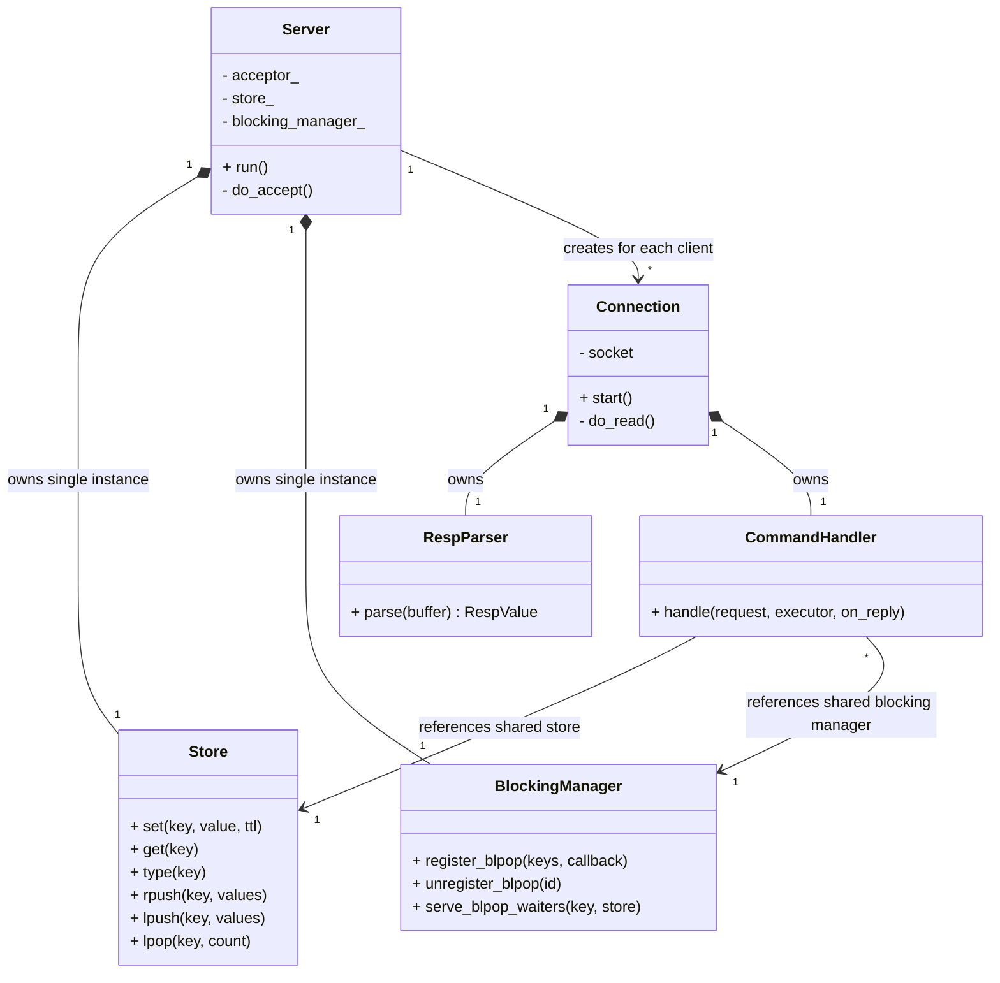

# Redis-Clone in C++


A Redis-compatible server implementation built from scratch in **C++23**.

## Goal

This project explores how a Redis-style in-memory database can be implemented from scratch in C++.  
The focus is on learning and understanding the internals of Redis.

Areas of exploration include:

- TCP networking & socket programming
- The RESP (Redis Serialization Protocol) wire format
- Command parsing
- In-memory data structures
- Concurrency & event loops
- Client/server communication

## Current Status

Already implemented:
- RESP2 protocol parsing (`SimpleString`, `BulkString`, `Integer`, `Array`, `Null`)
- Key-Value commands (`SET`, `GET`, `TYPE`)
- Basic utility commands (`PING`, `ECHO`)
- List commands (`RPUSH`, `LPUSH`, `LRANGE`, `LLEN`, `LPOP`, `BLPOP`)
- Key expiration via `EX` (seconds) and `PX` (milliseconds) flags on `SET`
- Lazy deletion of expired keys on access
- Async TCP server with per-client connections (`asio`) handles multiple concurrent clients
- Modular architecture (networking, RESP parsing, command handling, storage)

Planned:
- RDB Persistence
- AOF Persistence
- Streams
- Transactions
- Replication
- Pub/Sub
- Sorted Sets
- Geospatial commands
- Authentication
- Optimistic locking

## Tech Stack

- **Language:** C++23
- **Build System:** CMake
- **Package Management:** vcpkg
- **Networking:** asio (standalone)
- **Testing:** Google Test (GTest)

## Building
To build and run the server locally, you can use the provided script:
```bash
./program.sh
```

You can then connect with any Redis client:
```bash
redis-cli ping
redis-cli -p 6379
```

## Testing
To build and run the test suite (using GTest and CTest), use:
```bash
./run_tests.sh
```

## Architecture & Interaction

The following diagram illustrates how the core components interact to process a client request:



## Project Structure
```
src/
├── main.cpp                  # Entry point, sets up and runs the server
├── command/
│   ├── Command.hpp           # Command struct and type enum
│   ├── CommandHandler.hpp
│   └── CommandHandler.cpp    # Parses and dispatches Redis commands
├── net/
│   ├── Server.hpp
│   ├── Server.cpp            # Async TCP acceptor, manages connections
│   ├── Connection.hpp
│   └── Connection.cpp        # Per-client async read loop
├── resp/
│   ├── RespValue.hpp         # RESP value type
│   ├── RespParser.hpp
│   └── RespParser.cpp        # RESP2 protocol parser
├── store/
│   ├── Store.hpp
│   ├── Store.cpp             # In-memory key-value store with TTL support
│   ├── StoreValue.hpp        # Data structures for stored values
│   ├── BlockingManager.hpp
│   └── BlockingManager.cpp   # Manages async waiting clients (BLPOP, etc.)
└── util/
    └── StringUtils.hpp       # String helper utilities
```