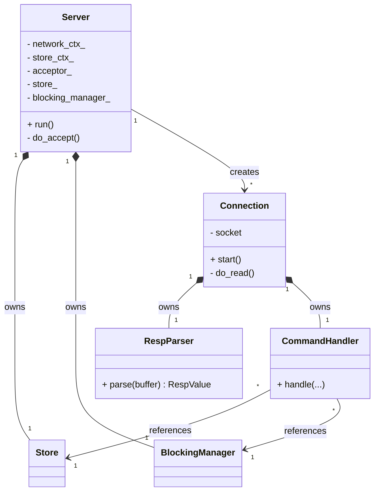
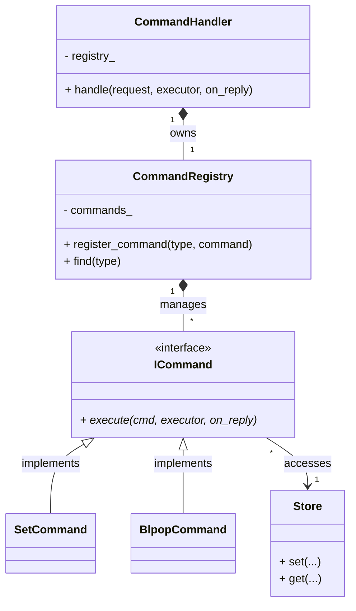

# Redis-Clone in C++


A Redis-compatible server implementation built from scratch in **C++23**.

## Goal

This project explores how a Redis-style in-memory database can be implemented from scratch in C++.  
The focus is on learning and understanding the internals of Redis.

Areas of exploration include:

- TCP networking and socket programming
- The RESP (Redis Serialization Protocol) wire format
- Command parsing
- In-memory data structures
- Concurrency & event loops
- Client/server communication

## Current Status

Already implemented:
- RESP2 protocol parsing (`SimpleString`, `BulkString`, `Integer`, `Array`, `Null`)
- Key-Value commands (`SET`, `GET`, `TYPE`)
- Basic utility commands (`PING`, `ECHO`)
- List commands (`RPUSH`, `LPUSH`, `LRANGE`, `LLEN`, `LPOP`, `BLPOP`)
- Key expiration via `EX` (seconds) and `PX` (milliseconds) flags on `SET`
- Lazy deletion of expired keys on access
- Multithreaded architecture (multi-reactor pattern): thread pool (`network_ctx`) handles async I/O, separated from a single-threaded lock-free store execution loop (`store_ctx`)
- Support for customizable port via `--port` command line argument and `REDIS_PORT` environment variable
- Modular architecture (networking, RESP parsing, command handling, storage)

Planned:
- RDB Persistence
- AOF Persistence
- Streams
- Transactions
- Replication
- Pub/Sub
- Sorted Sets
- Geospatial commands
- Authentication
- Optimistic locking

## Tech Stack

- **Language:** C++23
- **Build System:** CMake
- **Package Management:** vcpkg
- **Networking:** asio (standalone)
- **Testing:** Google Test (GTest)

## Building
To build and run the server locally, you can use the provided script:
```bash
./program.sh
```
Or with a specific port:
```bash
./program.sh --port 6380
```

You can then connect with any Redis client:
```bash
redis-cli ping
redis-cli -p 6379
```

## Testing
To build and run the test suite (using GTest and CTest), use:
```bash
./run_tests.sh
```

## Architecture & Interaction

To enforce separation of concerns, the architecture is decoupled into two primary areas: network I/O and command execution.

### 1. System & Networking
This layer manages the async event loop, individual client connections, and RESP protocol parsing. A dedicated pool of I/O threads is used for connection handling, while command execution and State management run safely within a lock-free single background thread.



### 2. Command Dispatch
Incoming parsed requests are routed using a Command Pattern, ensuring the system remains easily extensible when adding new Redis commands.



## Project Structure
```
src/
├── main.cpp                  # Entry point, sets up and runs the server
├── command/
│   ├── Command.hpp           # Command struct and type enum
│   ├── CommandHandler.hpp
│   ├── CommandHandler.cpp    # Processes requests via the registry
│   ├── CommandRegistry.hpp
│   ├── CommandRegistry.cpp   # Maps command types to target implementations
│   ├── ICommand.hpp          # Abstract base for executable commands
│   └── commands/             # Concrete command implementations
│       ├── BasicCommands.hpp # PING, SET, GET, ECHO, etc.
│       ├── BasicCommands.cpp
│       ├── ListCommands.hpp  # LPUSH, RPUSH, BLPOP, etc.
│       └── ListCommands.cpp
├── net/
│   ├── Server.hpp
│   ├── Server.cpp            # Async TCP acceptor, manages connections
│   ├── Connection.hpp
│   └── Connection.cpp        # Per-client async read loop
├── resp/
│   ├── RespValue.hpp         # RESP value type
│   ├── RespParser.hpp
│   └── RespParser.cpp        # RESP2 protocol parser
├── store/
│   ├── Store.hpp
│   ├── Store.cpp             # In-memory key-value store with TTL support
│   ├── StoreValue.hpp        # Data structures for stored values
│   ├── BlockingManager.hpp
│   ├── BlockingManager.cpp   # Manages async waiting clients (BLPOP, etc.)
│   └── types/
│       └── Stream.hpp        # Stream data structure
└── util/
    ├── CommandUtils.hpp      # Command parsing utilities
    ├── Logger.hpp            # Simple logger implementation
    └── StringUtils.hpp       # String helper utilities
```