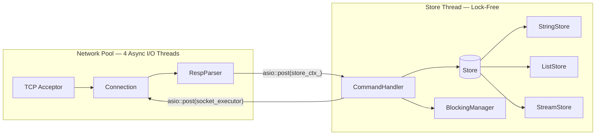
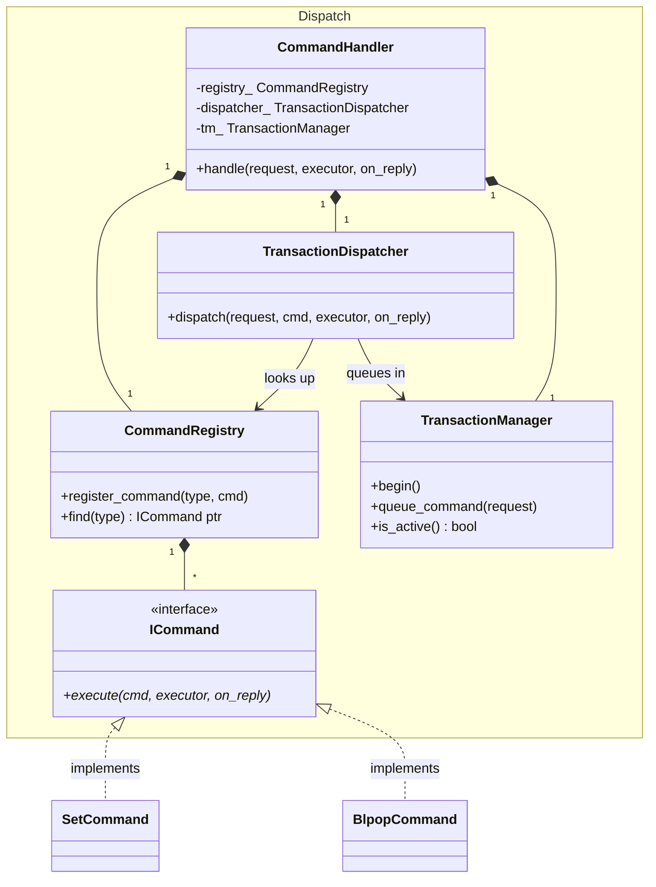

# Redis-Clone in C++


[](https://codecov.io/gh/fgulde/redis-clone)


A Redis-compatible server built from scratch in **C++23**, exploring in-memory databases, async I/O, and concurrent systems programming.

## Goal

This project reimplements core Redis internals as an exercise in systems programming. The focus is on understanding and rebuilding the primitives that make Redis fast:

- Non-blocking TCP networking with Asio
- RESP2 wire protocol — parsing and serialization
- In-memory storage with TTL and lazy expiry
- Lock-free concurrency via a dual Asio context (multi-reactor) design
- Extensible command dispatch using the Command pattern
- Client transactions and optimistic locking

---

## Current Status

### Implemented

#### Networking & Protocol
- RESP2 parsing: `SimpleString`, `BulkString`, `Integer`, `Array`, `Null`
- Multi-reactor architecture: 4 async I/O threads + 1 lock-free store thread
- Configurable port via `--port` flag or `REDIS_PORT` environment variable

#### Core Commands
- `SET`, `GET`, `TYPE`, `INCR`
- Key expiration via `EX` (seconds) and `PX` (milliseconds)
- Lazy deletion of expired keys on access

#### List Commands
- `RPUSH`, `LPUSH`, `LRANGE`, `LLEN`, `LPOP`
- `BLPOP` with configurable timeout

#### Stream Commands
- `XADD` with support for auto-generated IDs (`*`, `ms-*`)
- `XRANGE`with support for infinite bounds (`-`, `+`)
- `XREAD` including `BLOCK` mode and `$` for new entries only

#### Transactions & Locking
- `MULTI`, `EXEC`, `DISCARD`
- `WATCH`, `UNWATCH`, optimistic locking with dirty-transaction detection

### Planned

- RDB / AOF persistence
- Primary–replica replication
- Pub/Sub channels and patterns
- Sorted Sets
- Geospatial commands
- AUTH / ACL

---

## Tech Stack
- **Language:** C++23
- **Build System:** CMake
- **Package Management:** vcpkg
- **Async Networking:** Asio (standalone)
- **Testing:** Google Test
- **CI:** GitHub Actions
- **Coverage:** Codecov

---

## Quick Start

**Build and run:**
```bash
./program.sh
./program.sh --port 6380
```

**Connect with any Redis client:**
```bash
redis-cli ping
redis-cli -p 6379
```

**Run the test suite:**
```bash
./run_tests.sh
```

---

## Architecture

The server separates **network I/O** from **store execution** using two independent Asio contexts. All store operations run sequentially on a single dedicated thread — no locks required.

### System Overview

Commands travel from the network pool to the store thread via `asio::post`, and replies return the same way.



### Command Dispatch

`CommandHandler` routes each request through the `TransactionDispatcher`, which either queues it inside an active `MULTI` block or resolves it immediately via `CommandRegistry`. All concrete commands implement `ICommand`.



---

## Project Structure

```
src/
├── main.cpp
├── net/
│   ├── Server.hpp / .cpp             # TCP acceptor, owns shared state
│   └── Connection.hpp / .cpp         # Per-client async read loop
├── resp/
│   ├── RespValue.hpp                 # RESP2 value type (variant)
│   └── RespParser.hpp / .cpp         # Stateless RESP2 parser
├── command/
│   ├── ICommand.hpp                  # Pure-virtual command interface
│   ├── CommandHandler.hpp / .cpp     # Routes requests via registry & dispatcher
│   ├── CommandRegistry.hpp / .cpp    # Maps Command::Type → ICommand
│   ├── TransactionDispatcher.hpp / .cpp
│   ├── TransactionManager.hpp / .cpp
│   ├── WatchManager.hpp / .cpp
│   └── commands/
│       ├── BasicCommands.hpp / .cpp  # PING, ECHO, SET, GET, TYPE, INCR
│       ├── ListCommands.hpp / .cpp   # RPUSH, LPUSH, LRANGE, LLEN, LPOP, BLPOP
│       ├── StreamCommands.hpp / .cpp # XADD, XRANGE, XREAD
│       ├── TransactionCommands.hpp / .cpp # MULTI, EXEC, DISCARD
│       └── WatchCommands.hpp / .cpp  # WATCH, UNWATCH
├── store/
│   ├── Store.hpp                     # Facade delegating to sub-stores
│   ├── StoreValue.hpp                # std::variant<string, deque, Stream> + TTL
│   ├── StringStore.hpp / .cpp
│   ├── ListStore.hpp / .cpp
│   ├── StreamStore.hpp / .cpp
│   ├── BlockingManager.hpp / .cpp    # Callback registry for BLPOP / XREAD BLOCK
│   └── types/
│       ├── Stream.hpp
│       └── StreamIdUtils.hpp / .cpp
└── util/
    ├── Logger.hpp
    ├── StringUtils.hpp
    └── CommandUtils.hpp
```
