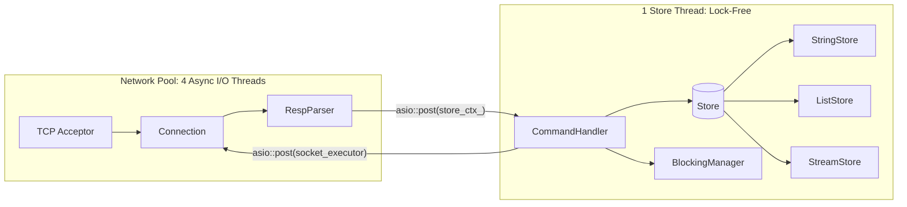
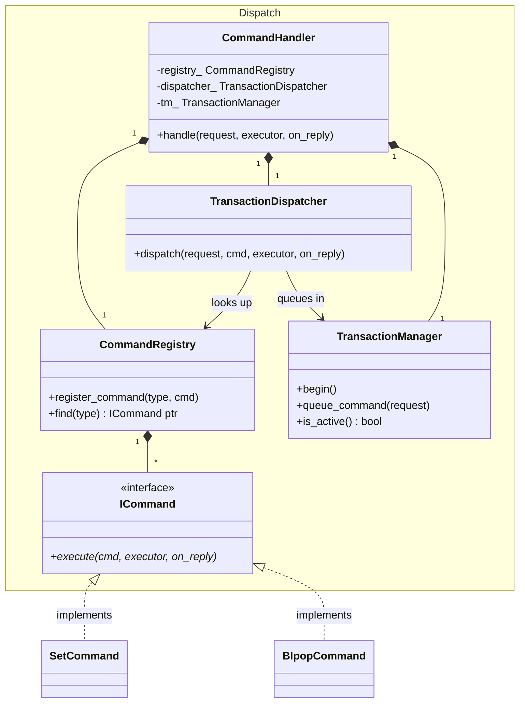
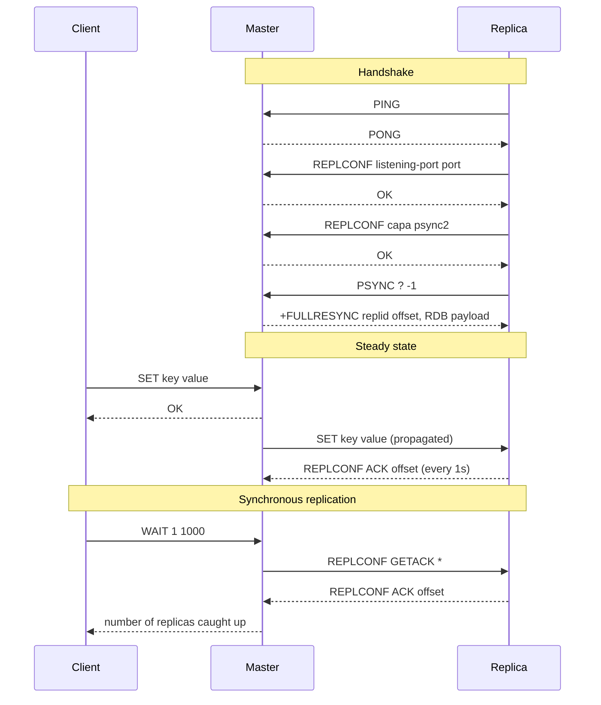

# Redis-Clone in C++


[](https://codecov.io/gh/fgulde/redis-clone)


A Redis-compatible server built from scratch in **C++23**, exploring in-memory databases, async I/O, and concurrent systems programming.

*Started from CodeCrafters' ["Build Your Own Redis"](https://codecrafters.io/challenges/redis) C++ starter (a ~60-line raw-socket skeleton, see the first commit). Everything since, the async architecture, RESP parser, command set, replication protocol, tests, and CI, was designed and built independently.*

## Goal

This project reimplements core Redis internals as an exercise in systems programming. The focus is on understanding and rebuilding the primitives that make Redis fast:

- Non-blocking TCP networking with Asio
- RESP2 wire protocol - parsing and serialization
- In-memory storage with TTL and lazy expiry
- Lock-free concurrency via a dual Asio context (multi-reactor) design
- Extensible command dispatch using the Command pattern
- Client transactions and optimistic locking
- Master-replica replication with offset tracking and synchronous-write guarantees (`WAIT`)

---

## Current Status

### Implemented

#### Networking & Protocol
- RESP2 parsing: `SimpleString`, `BulkString`, `Integer`, `Array`, `Null`
- Multi-reactor architecture: 4 async I/O threads + 1 lock-free store thread
- Configurable port via `--port` flag or `REDIS_PORT` environment variable

#### Core Commands
- `SET`, `GET`, `TYPE`, `INCR`
- Key expiration via `EX` (seconds) and `PX` (milliseconds)
- Lazy deletion of expired keys on access
- `INFO` (`server`, `clients`, `memory`, `replication` sections)

#### List Commands
- `RPUSH`, `LPUSH`, `LRANGE`, `LLEN`, `LPOP`
- `BLPOP` with configurable timeout

#### Stream Commands
- `XADD` with support for auto-generated IDs (`*`, `ms-*`)
- `XRANGE`with support for infinite bounds (`-`, `+`)
- `XREAD` including `BLOCK` mode and `$` for new entries only

#### Transactions & Locking
- `MULTI`, `EXEC`, `DISCARD`
- `WATCH`, `UNWATCH`, optimistic locking with dirty-transaction detection

#### Replication
- Replica mode via `--replicaof <host> <port>` at startup
- Full handshake: `PING` → `REPLCONF listening-port` → `REPLCONF capa` → `PSYNC`
- Command propagation from master to every connected replica, including commands queued in
  `MULTI`/`EXEC` (propagated only once they actually execute, never at queue time)
- Replication offset tracking on both master and replica, embedded in the `FULLRESYNC` reply and
  reported live via `INFO replication` (`master_repl_offset`, `connected_slaves`, per-replica
  `slaveN:offset=`)
- `REPLCONF ACK <offset>` heartbeat from replica to master, sent every second and immediately on
  demand via `REPLCONF GETACK *`
- `WAIT numreplicas timeout` for synchronous replication guarantees, without blocking the store
  thread while it waits

### Planned

- Real RDB file persistence (save/load to disk): the replication handshake currently sends a
  minimal placeholder RDB, not an actual snapshot of the dataset
- Manual replica promotion (`REPLICAOF NO ONE`) at runtime
- AOF persistence
- Pub/Sub channels and patterns
- Sorted Sets
- Geospatial commands
- AUTH / ACL

---

## Tech Stack
- **Language:** C++23
- **Build System:** CMake
- **Task Runner:** just
- **Package Management:** vcpkg
- **Async Networking:** Asio (standalone)
- **Testing:** Google Test
- **CI:** GitHub Actions
- **Coverage:** Codecov

---

## Quick Start

**Build and run with `just` (recommended):**
```bash
just build
just run
just run -- --port 6380
```

**Run as a replica of another instance:**
```bash
just run -- --port 6380 --replicaof localhost 6379
```

**Run the test suite:**
```bash
just test
```

**Legacy shell wrappers are still available:**
```bash
./program.sh
./program.sh --port 6380
./run_tests.sh
```

**Connect with any Redis client:**
```bash
redis-cli ping
redis-cli -p 6379
```


---

## Architecture

The server separates **network I/O** from **store execution** using two independent Asio contexts. All store operations run sequentially on a single dedicated thread – no locks required. The one exception is replication bookkeeping (`ReplicaRegistry`), which is written from multiple network threads and is therefore mutex-protected.

### System Overview

Commands travel from the network pool to the store thread via `asio::post`, and replies return the same way.


```mermaid
flowchart LR
    subgraph net_pool["Network Pool: 4 Async I/O Threads"]
        A[TCP Acceptor] --> B[Connection]
        B --> C[RespParser]
    end

    subgraph store_thread["1 Store Thread: Lock-Free"]
        D[CommandHandler] --> E[(Store)]
        D --> F[BlockingManager]
        E --> G[StringStore]
        E --> H[ListStore]
        E --> I[StreamStore]
    end

    C -->|"asio::post(store_ctx_)"| D
    D -->|"asio::post(socket_executor)"| B
```

### Command Dispatch

`CommandHandler` routes each request through the `TransactionDispatcher`, which either queues it inside an active `MULTI` block or resolves it immediately via `CommandRegistry`. All concrete commands implement `ICommand`.


```mermaid
classDiagram
    namespace Dispatch {
        class CommandHandler {
            -registry_ CommandRegistry
            -dispatcher_ TransactionDispatcher
            -tm_ TransactionManager
            +handle(request, executor, on_reply)
        }
        class TransactionDispatcher {
            +dispatch(request, cmd, executor, on_reply)
        }
        class TransactionManager {
            +begin()
            +queue_command(request)
            +is_active() bool
        }
        class CommandRegistry {
            +register_command(type, cmd)
            +find(type) ICommand ptr
        }
        class ICommand {
            <<interface>>
            +execute(cmd, executor, on_reply)*
        }
    }

    CommandHandler "1" *-- "1" CommandRegistry
    CommandHandler "1" *-- "1" TransactionDispatcher
    CommandHandler "1" *-- "1" TransactionManager
    TransactionDispatcher --> CommandRegistry : looks up
    TransactionDispatcher --> TransactionManager : queues in
    CommandRegistry "1" *-- "*" ICommand
    ICommand <|.. SetCommand : implements
    ICommand <|.. BlpopCommand : implements
```

### Replication Protocol

A replica drives the handshake and command stream itself (`ReplicationManager` + `ReplicationSession`); the master answers through the same command-dispatch path every normal client uses, plus a `ReplicaRegistry` that fans out propagated writes and tracks each replica's acknowledged offset.


```mermaid
sequenceDiagram
    participant C as Client
    participant M as Master
    participant R as Replica

    Note over M,R: Handshake
    R->>M: PING
    M-->>R: PONG
    R->>M: REPLCONF listening-port port
    M-->>R: OK
    R->>M: REPLCONF capa psync2
    M-->>R: OK
    R->>M: PSYNC ? -1
    M-->>R: +FULLRESYNC replid offset, RDB payload

    Note over M,R: Steady state
    C->>M: SET key value
    M-->>C: OK
    M->>R: SET key value (propagated)
    R-->>M: REPLCONF ACK offset (every 1s)

    Note over C,R: Synchronous replication
    C->>M: WAIT 1 1000
    M->>R: REPLCONF GETACK *
    R-->>M: REPLCONF ACK offset
    M-->>C: number of replicas caught up
```

---

## Project Structure

```
src/
├── main.cpp
├── net/
│   ├── Server.hpp / .cpp             # TCP acceptor, owns shared state (Store, ReplicaRegistry, ...)
│   └── Connection.hpp / .cpp         # Per-client/replica async read loop, handshake state machine
├── resp/
│   ├── RespValue.hpp                 # RESP2 value type (variant)
│   └── RespParser.hpp / .cpp         # Stateless RESP2 parser + serializer
├── state/
│   ├── ServerConfig.hpp              # Master/replica role, replicaof target, replid, offset
│   ├── WatchManager.hpp / .cpp       # Shared WATCH registry for all connections
│   └── BlockingManager.hpp / .cpp    # Shared blocking registry for BLPOP / XREAD BLOCK
├── replication/
│   ├── ReplicaRegistry.hpp / .cpp    # Master-side: propagation fan-out, offsets, ACK bookkeeping
│   ├── ReplicationManager.hpp / .cpp # Replica-side: resolves + connects to the configured master
│   └── ReplicationSession.hpp / .cpp # Replica-side: handshake, RDB receive, command stream, ACKs
├── command/
│   ├── core/                          # Abstractions, registry, type definitions
│   │   ├── ICommand.hpp               # Pure-virtual command interface
│   │   ├── Command.hpp                # Command type enum + parsing
│   │   └── CommandRegistry.hpp / .cpp # Maps Command::Type → ICommand
│   ├── execution/                     # Per-connection execution engine
│   │   ├── CommandHandler.hpp / .cpp  # Routes requests via registry & dispatcher
│   │   ├── TransactionManager.hpp / .cpp
│   │   └── TransactionDispatcher.hpp / .cpp # MULTI/EXEC execution + write propagation
│   └── impl/                          # Concrete command implementations
│       ├── BasicCommands.hpp / .cpp   # PING, ECHO, SET, GET, TYPE, INCR, INFO
│       ├── ListCommands.hpp / .cpp    # RPUSH, LPUSH, LRANGE, LLEN, LPOP, BLPOP
│       ├── StreamCommands.hpp / .cpp  # XADD, XRANGE, XREAD
│       ├── TransactionCommands.hpp / .cpp # MULTI, EXEC, DISCARD
│       ├── WatchCommands.hpp / .cpp   # WATCH, UNWATCH
│       └── ReplicationCommands.hpp / .cpp # REPLCONF, PSYNC, WAIT
├── store/
│   ├── core/                          # Facade + shared value/type definitions
│   │   ├── Store.hpp                  # Facade delegating to sub-stores
│   │   ├── StoreValue.hpp             # Value wrapper: std::variant<string, deque, Stream> + TTL
│   │   └── StoreType.hpp
│   ├── impl/                          # Store implementations (per data type)
│   │   ├── StringStore.hpp / .cpp     # String operations
│   │   ├── ListStore.hpp / .cpp       # List operations
│   │   └── StreamStore.hpp / .cpp     # Stream operations
│   └── types/                         # Domain-specific data types
│       ├── Stream.hpp                 # Stream, StreamId, StreamRange, StreamEntry
│       └── StreamIdUtils.hpp / .cpp   # Stream ID parsing and generation
└── util/
    ├── Logger.hpp
    ├── StringUtils.hpp
    ├── CommandUtils.hpp
    └── MemoryEstimator.hpp            # Approximate memory usage for INFO memory
```

```
tests/
├── main_test.cpp                     # Google Test entry point, disables logging globally
├── helpers/
│   ├── test_server.hpp               # RAII wrapper: starts a real Server on an ephemeral port
│   └── test_client.hpp               # Synchronous RESP2 client for sending raw commands
├── unit/                             # Pure logic, no networking: RespParser, CommandUtils, ReplicaRegistry, ...
└── integration/                      # Full client/server round-trips over real sockets: SET/GET, transactions, replication, WAIT, ...
```
